# P2P Network: Communication and File Sharing

| | |
|---|---|
| **University** | University of Asia Pacific, Department of CSE |
| **Course** | CSE 433 - Blockchain & Distributed Security Lab |
| **Student** | Md Abdullah Al Jobayer |
| **ID / Section** | 22201245 / E1 |
| **Language** | Python 3.9+ (developed with 3.13), standard library only |

---

## 1. Project Description

This project is a lightweight **peer-to-peer (P2P)** application built on **TCP sockets**.
Each user runs one *peer* on their own computer. Peers connect **directly** to each other
using an IP address and a port number, with **no central server**, and can exchange
**text messages** and **files** (text, images, audio, video, PDF, ZIP or any other ordinary file).

Every peer plays two roles at the same time:

```
Every peer = TCP Server (accepts connections) + TCP Client (connects to others)
```

```
  Client-server:   Client A --> Central Server <-- Client B
  This project:    Peer A <--------------------> Peer B
                      \                         /
                       \---->   Peer C   <-----/
```

### Features

- Start a peer with a **name** and a **listening port**; Stop it at any time.
- Connect to any other peer by **IP + port**; a **HELLO handshake** exchanges identities.
- **Connected peer list** showing `Name [peer_id]`.
- **Text messaging** to one selected peer.
- **File transfer** of any binary file to one selected peer, sent in **64 KB chunks** so large
  videos are never loaded into memory.
- **Multiple simultaneous peers**; one thread per connection, so everything runs concurrently.
- **Simple Tkinter GUI** with an event/communication log.
- **Error handling** that keeps the program running (see section 9).

---

## 2. Requirements

| Item | Requirement |
|---|---|
| Python | 3.9 or later |
| OS | Windows, Linux or macOS |
| Libraries | Standard library only: `socket`, `threading`, `json`, `struct`, `queue`, `os`, `uuid`, `tkinter` |
| Third-party packages | **None** (`requirements.txt` only documents this) |
| Network (2+ computers) | All computers on the same Wi-Fi / LAN |

On some Linux systems Tkinter is a separate package:

```bash
sudo apt install python3-tk
```

---

## 3. Installation / Setup

1. Unzip the project folder.
2. Open a terminal inside the folder that contains `main.py`.
3. Nothing needs to be installed.

Check your Python version if unsure:

```bash
python --version
```

---

## 4. How to Run

```bash
python main.py
```

(Use `python3 main.py` on systems where `python` is not Python 3.)

Run the command once per peer; each run opens one window.

---

## 5. Project Structure

```
P2P_Network/
|-- main.py            User interface (Tkinter GUI)
|-- p2p_node.py        P2P networking: server + client, handshake, threads, text, file transfer
|-- protocol.py        Message framing (4-byte length + JSON) and message builders
|-- requirements.txt   States that no third-party packages are needed
|-- README.md          This file
|-- screenshots/       Screenshots used in this README
`-- downloads/         Files received from other peers are saved here
```

| File | Responsibility |
|---|---|
| `main.py` | Window, buttons, input validation (name, port, IP); shows events sent by the network layer. |
| `p2p_node.py` | `P2PNode` class: listening socket, accept loop, outgoing connections, handshake, per-peer receive threads, sending/receiving text and files. |
| `protocol.py` | `send_message()`, `recv_message()`, `recv_exact()` and the builders for `hello`, `hello_ack`, `text`, `file`, `error` messages. |

---

## 6. How to Use

All screenshots below were taken while running the application on one computer
(peers on `127.0.0.1`, using different ports). The window shows the peer's LAN address
(`192.168.0.118` in these screenshots), which is what other computers would use to connect.

### 6.1 Start a peer

1. Enter a **Name** (e.g. `Alice`) and a **Port** (e.g. `5000`).
2. Click **Start Peer**. The window shows your address, e.g. `192.168.0.118:5000`.
   Other people use this address to connect to you.
3. Click **Stop** to close all connections and the listening socket.

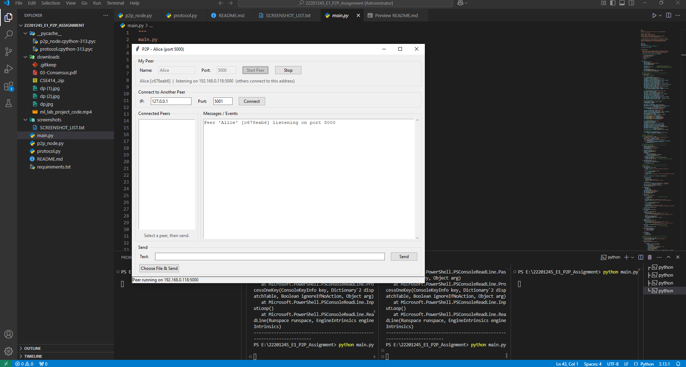

*Figure 1: Alice started on port 5000. The window title changes to "P2P - Alice (port 5000)", the name/port fields and Start Peer are locked, and Connect, Send and Choose File are enabled. The peer's ID (`c678eab6`) and listening address appear under "My Peer", and the log confirms `Peer 'Alice' [c678eab6] listening on port 5000`.*

### 6.2 Connect two peers

**On the same computer (testing)** - peers must use different ports, because only one program
can listen on a given port.

1. Window 1: Name `Alice`, Port `5000`, **Start Peer**.
2. Window 2: Name `Bob`, Port `5001`, **Start Peer**.
3. In Bob's window enter IP `127.0.0.1`, Port `5000`, click **Connect**.
4. Both windows now list each other under **Connected Peers**.

**On two computers (same Wi-Fi / LAN)**

1. Alice starts her peer and reads her address from the window (e.g. `192.168.0.118:5000`).
2. On Bob's computer, enter that IP and port and click **Connect**.
3. If it fails, see [Troubleshooting](#10-troubleshooting).

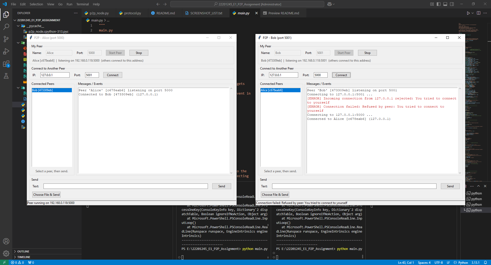

*Figure 2: Alice (left) and Bob (right) connected. After the HELLO handshake each peer lists the other as `Name [peer_id]` under Connected Peers (Alice sees `Bob [473309eb]`, Bob sees `Alice [c678eab6]`). In Bob's log, his first attempt was accidentally to his own port 5001 and was refused with "You tried to connect to yourself"; the second attempt, to port 5000, succeeded.*

**Connecting to a peer you are already connected to** is refused, so the same pair never ends up
with duplicate connections:


*Figure 3: Alice and Bob are already connected. Clicking Connect again (from either side) is rejected with "Already connected to this peer"; the existing connection keeps working and the chat continues normally ("hmmmm" / "what???").*

### 6.3 Send a text message

1. Click a peer's name in **Connected Peers** (a single connected peer is selected automatically).
2. Type in the **Text** box and press **Enter** or click **Send**.
3. The receiver sees `Name -> You: message`; the sender sees `You -> Name: message`.

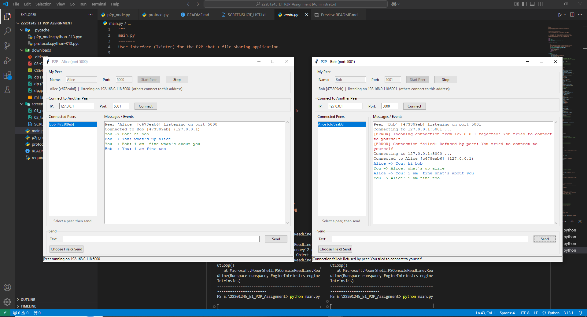

*Figure 4: Text messages sent in both directions with no server involved. Outgoing messages (`You -> Bob: ...`) are shown in green and incoming ones (`Bob -> You: ...`) in blue in Alice's window; Bob's window shows the same conversation from his side.*

### 6.4 Send a file

1. Select a peer in **Connected Peers**.
2. Click **Choose File & Send** and pick any file (image, audio, video, PDF, ZIP, ...).
3. The sender's log shows `Sending ...` then `... done`; the receiver's log shows
   `File received from ...`, and the file appears in the `downloads/` folder.
4. If a file with the same name already exists it is saved as `name (1).ext`,
   `name (2).ext`, ... so nothing is overwritten.


*Figure 5: Clicking Choose File & Send opens the standard file dialog. Here `landscape-4389208.jpg` is selected to send to Bob, who is highlighted in the Connected Peers list.*

#### Image (Alice -> Bob)

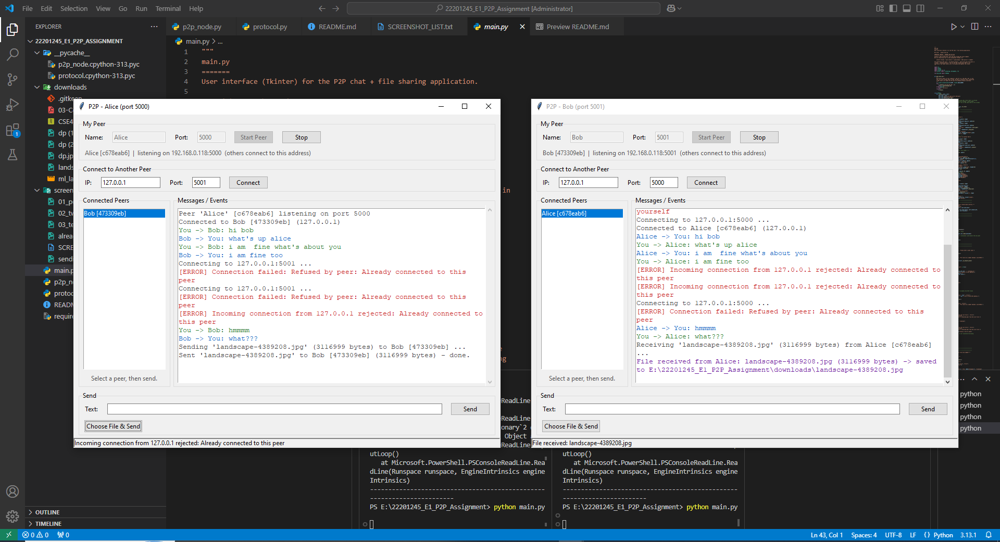

*Figure 6: Alice sends `landscape-4389208.jpg` (3,116,999 bytes). Alice's log shows `Sent ... - done.`; Bob's log shows `Receiving ...` followed by `File received from Alice ... saved to ...\downloads\landscape-4389208.jpg`.*

#### Audio (Bob -> Alice)

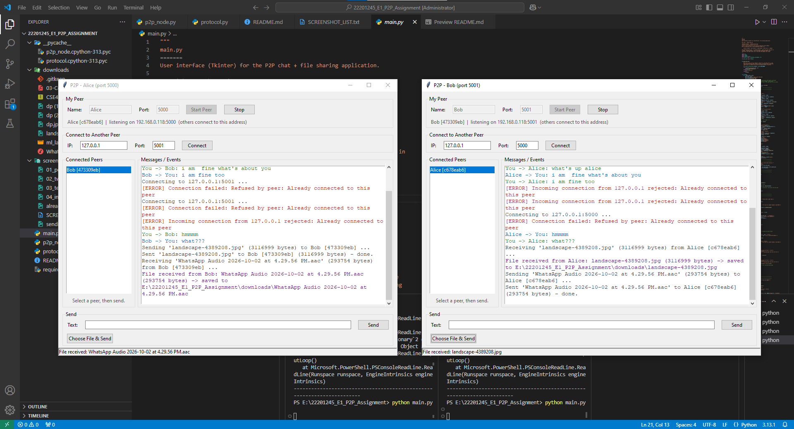

*Figure 7: Bob sends an audio file, `WhatsApp Audio 2026-10-02 at 4.29.56 PM.aac` (293,754 bytes). It is received by Alice and saved in her `downloads/` folder; the status bar shows "File received: WhatsApp Audio ...".*

#### Video (Alice -> Bob)

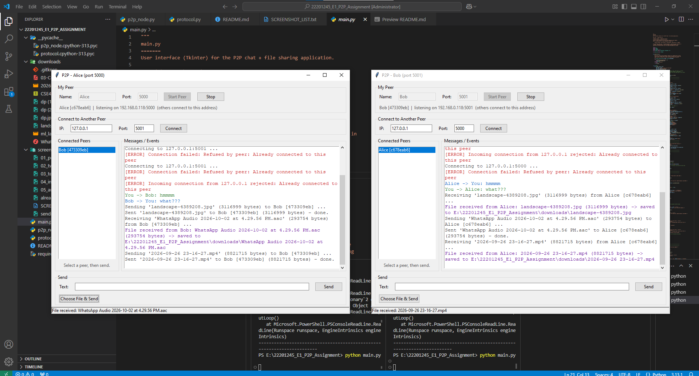

*Figure 8: Alice sends a video, `2026-09-26 23-16-27.mp4` (8,821,715 bytes). The file is sent in 64 KB chunks, and Bob receives and saves the complete file; his log shows `File received from Alice ... saved to ...\downloads\2026-09-26 23-16-27.mp4`.*

#### PDF and ZIP (Bob -> Alice)


*Figure 9: Bob sends a PDF document (236,955 bytes). Alice's log shows `File received from Bob: ... .pdf` and the full save path.*


*Figure 10: Bob then sends `conference-latex-template.zip` (855,435 bytes). Together with the previous screenshots this shows that text, image, audio, video, PDF and ZIP files are all handled as plain binary data by the same code.*

#### Received files

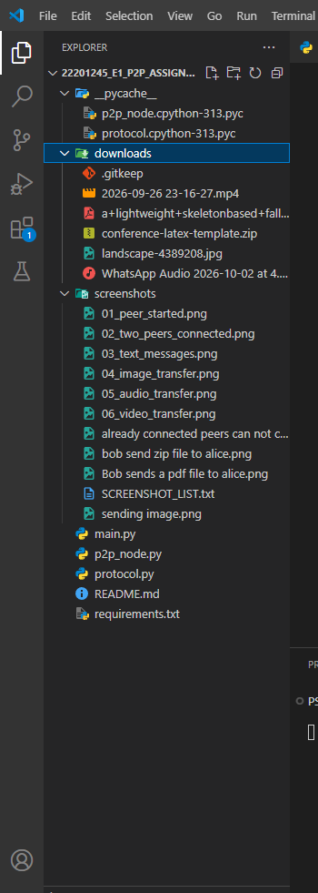

*Figure 11: The `downloads/` folder after the transfers, containing the received `.mp4`, `.pdf`, `.zip`, `.jpg` and `.aac` files.*

### 6.5 Multiple peers

Charlie starts a peer (e.g. port `5002`) and connects to Alice and/or Bob the same way.
A peer can be connected to any number of other peers. Select the target in the list before each
message or file; it is sent **only** to the selected peer.

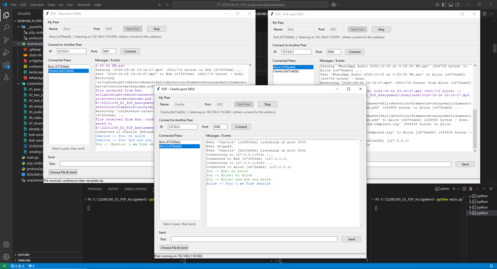

*Figure 12: Alice (5000), Bob (5001) and Charlie (5002) running at the same time. Each peer lists the other two under Connected Peers. Charlie connected to Bob and to Alice and exchanged text messages with them.*

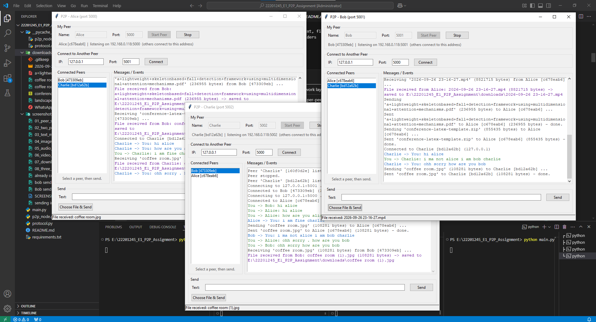

*Figure 13: Communication between different pairs. Charlie sends `coffee room.jpg` to Alice, and Bob sends the same image to Charlie. Charlie's copy is saved as `coffee room (1).jpg` because a file with that name already existed, so nothing is overwritten. Text messages between Bob and Charlie are visible in the logs.*

---

## 7. How It Works

```
User Interface (main.py)
        |
   P2P Node (p2p_node.py)       <- server socket + client connections + threads
        |
   TCP Socket
        |
   Other Peer
```

| Layer | What happens |
|---|---|
| **IP + port** | Identify the other peer's computer and the program on it. |
| **TCP socket** | Server side: `socket -> bind -> listen -> accept`. Client side: `socket -> connect`. The server binds to `0.0.0.0` so other computers on the LAN can reach it. |
| **Handshake** | The connecting peer sends `hello`; the other replies `hello_ack`. Both learn each other's `peer_id`, name and listening port. A peer refuses (with an `error` message) if someone connects to themselves or if the two peers are already connected. |
| **Framing** | Every message is `[4-byte length][JSON payload]`, so the receiver always knows where one message ends. TCP is a byte stream and does not keep message boundaries. |
| **Threads** | One thread accepts new connections; one thread per connected peer reads that peer's messages; file sending also runs in its own thread so the GUI never freezes. |
| **Text** | A JSON message of type `text`. |
| **Files** | JSON metadata (`filename`, `filesize`) first, then exactly `filesize` raw bytes in 64 KB chunks. The receiver uses the size to know when the file is complete (it never assumes one `recv()` is one file). |
| **GUI updates** | Tkinter is not thread-safe, so network threads put events into a `queue.Queue` and the GUI thread reads it every 100 ms. |

### 7.1 Message formats

```json
{"type": "hello",     "peer_id": "a83f21c4", "peer_name": "Alice", "port": 5000}
{"type": "hello_ack", "peer_id": "92bd71e3", "peer_name": "Bob",   "port": 5001}
{"type": "text", "sender_id": "a83f21c4", "sender_name": "Alice", "message": "Hello Bob!"}
{"type": "file", "sender_id": "a83f21c4", "sender_name": "Alice", "filename": "photo.jpg", "filesize": 2456789}
{"type": "error", "reason": "Already connected to this peer"}
```

### 7.2 Framing

```
+----------------+---------------------------+
| 4-byte length  |  JSON message (N bytes)   |
+----------------+---------------------------+
```

The length is an unsigned 32-bit integer in network byte order (`struct` format `!I`).
JSON messages larger than 1 MB are rejected as invalid.

### 7.3 File transfer sequence

```
Sender                                   Receiver
  |-- [len][{"type":"file", ...}] ------>|   1. metadata (framed JSON)
  |-- raw bytes, 64 KB chunk ----------->|   2. exactly `filesize` bytes
  |-- raw bytes, 64 KB chunk ----------->|      written to downloads/<filename>
  |-- ...                                |
  |                                      |   3. done when received == filesize
```

The sender holds a per-connection lock for the whole transfer, so a text message can never be
inserted into the middle of the file bytes.

---

## 8. Testing

| Test | What was checked | Result |
|---|---|---|
| Same computer (127.0.0.1) | Connection, text, image, audio, video | Passed |
| Two computers (LAN) | Connect by LAN IP and exchange messages/files | [Fill in after testing] |
| Multiple peers (3) | Alice-Bob, Bob-Charlie, Charlie-Alice; files between different pairs | Passed |
| File integrity | Received files were compared byte-for-byte (SHA-256) with the originals, including a 60 MB video, a 0-byte file and files of 64 KB and 64 KB + 1 byte | Passed |
| Simultaneous transfers | Two large files sent in opposite directions while a text message was sent | Passed |
| Error cases | See section 9 | Passed |

---

## 9. Error Handling

The application shows an `[ERROR]` message in the log and keeps running for:

| Situation | Behaviour |
|---|---|
| Invalid IP address | Rejected before connecting, with a message box and log entry. |
| Invalid port (not a number, or outside 1-65535) | Rejected for both the listening port and the remote port. |
| Peer is not running / connection refused | `[ERROR] Connection failed: ... Connection refused` |
| Unreachable computer | Gives up after 5 seconds with a timeout message. |
| Connecting to yourself / to an already-connected peer | Refused with an explanatory message. |
| Peer disconnects unexpectedly | The peer is removed from the list and a message is shown; the program does not crash. |
| Peer disconnects during a file transfer | The incomplete file is deleted; the sender and other connections keep working. |
| File does not exist | `File does not exist: ...` |
| Invalid file size / bad metadata | The sender of bad metadata is disconnected; the program continues. |
| Sending without selecting a peer | Warning asking you to select a peer first. |
| Listening port already in use | `Cannot listen on port ...` |

**Security note:** received file names are stripped of any folder part, so a peer cannot write
outside the `downloads/` folder (a name such as `../../evil.py` is saved as `evil.py`).

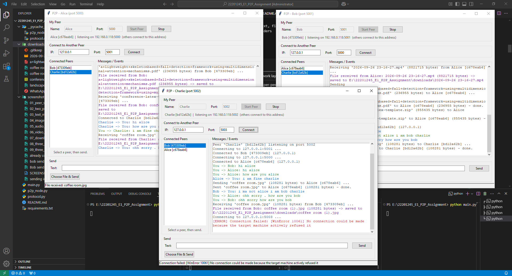

*Figure 14: Charlie tries to connect to `127.0.0.1:5003`, where no peer is running. The log shows `[ERROR] Connection failed: [WinError 10061] No connection could be made because the target machine actively refused it` (the Windows wording of "Connection refused"), and the application keeps running normally.*

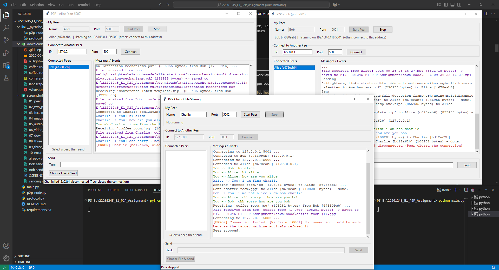

*Figure 15: Charlie clicks Stop (his window shows "Peer stopped." and "Not running", and his controls are disabled). Alice's and Bob's logs show `Charlie [bd12a62b] disconnected (Peer closed the connection)`, Charlie disappears from their Connected Peers lists, and their connection to each other is unaffected.*

(The "already connected" error is shown in Figure 3.)

---

## 10. Troubleshooting

| Problem | Fix |
|---|---|
| "Connection refused" | The other peer is not running, or the IP/port is wrong. |
| Works on one computer but not between two | Usually a firewall. On Windows allow Python through *Windows Defender Firewall* (tick *Private networks*). Both computers must be on the same Wi-Fi/LAN. |
| "Cannot listen on port ..." | The port is already in use. Choose another port. |
| Campus/public Wi-Fi blocks connections | Some networks isolate devices from each other. Use a phone hotspot or home router for the demo. |
| `import tkinter` fails (Linux) | `sudo apt install python3-tk` |

---

## 11. Limitations (out of scope)

As allowed by the assignment: no encryption or authentication, no NAT traversal, no automatic
peer discovery, no resume of interrupted transfers, and no blockchain. Peers must be given an
IP and port manually. If two users press **Connect** towards each other at exactly the same moment,
the connection can end up in an inconsistent state. Only one peer should click **Connect**; if it does happen, close one of the peers and connect again.

---

## 12. Screenshots Summary

All images are stored in the `screenshots/` folder.

| Figure | File | Shows |
|---|---|---|
| 1 | `01_peer_started.png` | A peer started and listening |
| 2 | `02_two_peers_connected.png` | Two peers connected, peer lists visible |
| 3 | `already connected peers can not connect again until disconnection.png` | Duplicate connection refused |
| 4 | `03_text_messages.png` | Text messages in both directions |
| 5 | `sending image.png` | Choosing a file to send |
| 6 | `04_image_transfer.png` | Image sent and received |
| 7 | `05_audio_transfer.png` | Audio file sent and received |
| 8 | `06_video_transfer.png` | Video file sent and received |
| 9 | `Bob sends a pdf file to alice.png` | PDF sent and received |
| 10 | `bob send zip file to alice.png` | ZIP file sent and received |
| 11 | `07_downloads_folder.png` | Received files in `downloads/` |
| 12 | `08_three_peers_connected.png` | Three peers connected |
| 13 | `09_three_peer_communication.png` | Communication involving the third peer |
| 14 | `10_error_connection_refused.png` | Error handling: connection refused |
| 15 | `11_peer_disconnected.png` | A peer disconnecting is handled |
